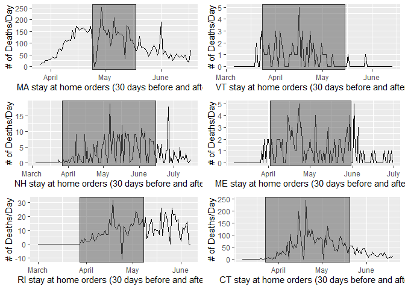

Mini Project 2
================
David Ellinger

# Background and Significance

For my project, I am consuming the [API from The Covid Tracking
Project](https://covidtracking.com/data/api). The datasets provided
allow for in depth analysis of the U.S national and state data relating
to Covid-19. Covid-19 has rapidly been spreading over the course of the
last year. Analyzing data may help us better prepare for the next
pandemic, help develop a vaccine, drive better pandemic safety protocols
in the future.

# Problem

Was there a decrease in daily deaths after a state gave stay at home
orders?

# Proposed Solution

My solution pulls down data for all states in the New England region of
the united states. Based on the National Academy for State Health
Policy, the original stay at home order dates are captured along with
other information. Each state is different in their policies so it is
not a one for one match, but does give a good regional idea.

# Demo

    ## Installing package into 'C:/Users/david/Documents/R/win-library/4.0'
    ## (as 'lib' is unspecified)

    ## package 'pacman' successfully unpacked and MD5 sums checked
    ## 
    ## The downloaded binary packages are in
    ##  C:\Users\david\AppData\Local\Temp\RtmpcbCz27\downloaded_packages

    ## No encoding supplied: defaulting to UTF-8.

    ## No encoding supplied: defaulting to UTF-8.
    ## No encoding supplied: defaulting to UTF-8.
    ## No encoding supplied: defaulting to UTF-8.
    ## No encoding supplied: defaulting to UTF-8.
    ## No encoding supplied: defaulting to UTF-8.

<!-- -->

# Improvements

There is a lot that can be improved here, as far as visibility and scope
of data. Applying this to all states would be difficult due to each
state having autonomous guidelines.

# References

National Academy for State Health Policy. (2020, September 10).

Chart: Each State’s COVID-19 Reopening and Reclosing Plans and Mask
Requirements \[Dataset\].
<https://www.nashp.org/governors-prioritize-health-for-all/>

The COVID Tracking Project. (2020, March 1). Data API \[Dataset\].
<https://covidtracking.com/data/api/>
