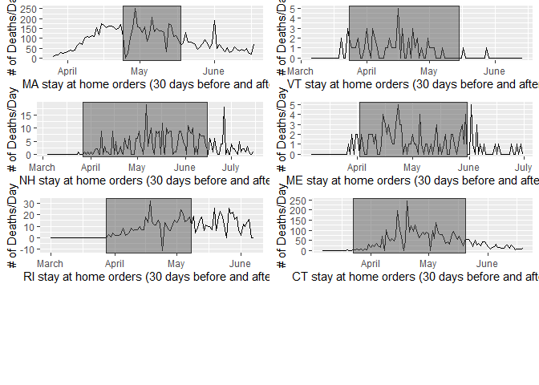

Covid Data Analytics
================
David Ellinger

# Setup

    ## Loading required package: pacman

# Correlation of positive test results and death

``` r
api <- "api.covidtracking.com/v1/states/ma/daily.json"
raw_state_data <- GET(api)
raw_state_text <- content(raw_state_data, "text")
```

    ## No encoding supplied: defaulting to UTF-8.

``` r
raw_state_json <- fromJSON(raw_state_text)
state_data <- as.data.frame(raw_state_json)


ggplot(state_data) +
  aes(x = positive, y = death) +
  geom_point(colour = "#0c4c8a") +
  theme_minimal()
```

    ## Warning: Removed 56 rows containing missing values (geom_point).

<!-- -->
